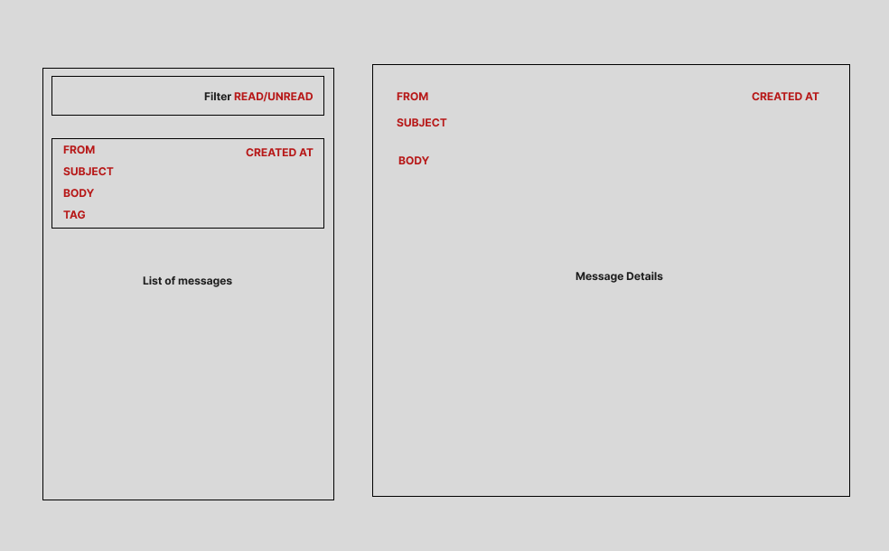

# Email Challenge

This is a simple email client application built as part of a technical challenge. The application allows users to manage email messages, categorize them with tags, and track their read/unread status. It is built using the Remix fullstack framework and TypeScript.

## Features

- Email Management: Create, read, update, and delete email messages stored in a database.
- Tags: Add tags to messages for categorization (e.g., "work", "important").
- Read/Unread Status: Mark emails as read or unread to keep track of your progress.

## Tech Stack

- Remix Framework: Fullstack framework for building the application.
- TypeScript: Strongly typed language for better code quality and maintainability.
- Prisma: Database ORM for managing email messages efficiently.
- SQLite: Local database for simple storage during development (can be replaced with another database in production).
- Tailwind CSS (Optional): For a clean and responsive UI, based on the shadcn UI library. 🔗https://ui.shadcn.com/examples/mail

## UI



## Development

Run the dev server:

```shellscript
npm run dev
```